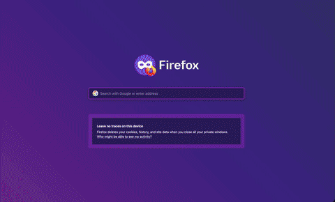

# BreakDOOMout - Can Breakout run DOOM?

Breakout, bricks are DOOM and behind them, DOOM.

Mouse for paddle, keyboard for DOOM.



## How

DOOM running natively on the brower in WASM. Breakout written in client-side JS.

## Setup

Need [emsdk](https://emscripten.org/docs/getting_started/downloads.html) to compile doomgeneric to WASM, which is pretty damn cool.

In `emsdk/`:

```
./emsdk install latest
./emsdk activate latest
source emsdk_env.sh
```

`doom1.wad` should be in the project root.

Build in `doomgeneric/doomgeneric`:

```
ln -s ../../doom1.wad .
make -f Makefile.emscripten
```

## Running

Any static file server works.

```
python3 -m http.server 3000
```

Open `http://localhost:3000` and DOOM it up.

## Controls

- Mouse: breakout paddle thingie
- Keyboard: DOOM (arrow keys, space to use/open, ctrl to shoot)
  (AWSD+F should work, but I couldn't get it working... PRs welcome!)

## License

* Code: MIT
* `doom1.wad`: id Software shareware.

## Why

Because DOOM, gosh darn it!
